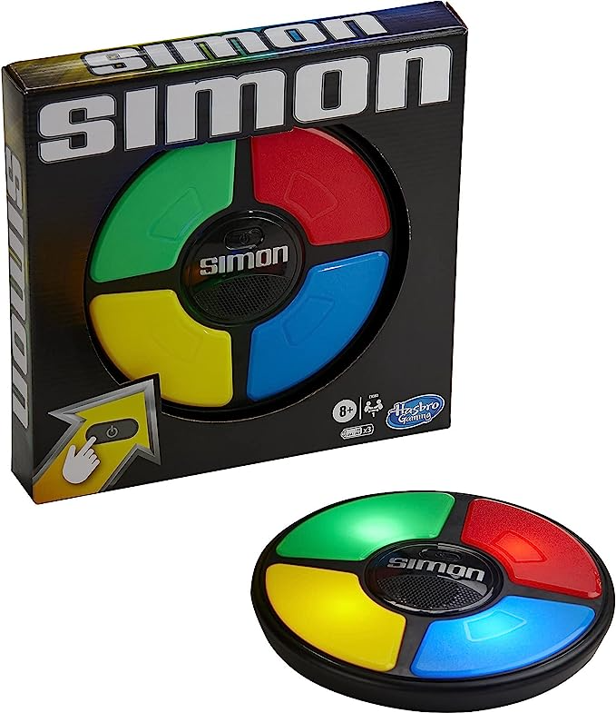
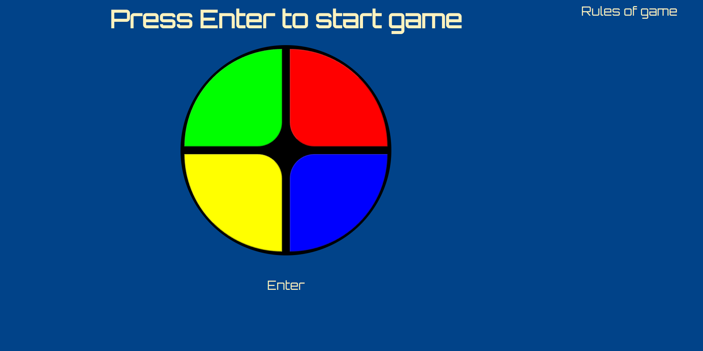

## The Dicee Game

The **Simon Game** is a simple web site game written in *html*, *css*, *javascript*    


[Simon](https://en.wikipedia.org/wiki/Simon_(game)) is an electronic game of short-term memory skill invented by **Ralph H. Baer** and **Howard J. Morrison**, with software programming by **Lenny Cope**.       
The original version was manufactured and distributed by **Milton Bradley** and later by **Hasbro** after it took over Milton Bradley.      
Simon was launched in 1978 at Studio 54 in New York City and was an immediate success, becoming a pop culture symbol of the 1970s and 1980s.      




Try "The **Simon Game**" [here](https://resole79.github.io/the-simon-game/)     


###### It's a part of the **The Complete 2023 Web Development Bootcamp** challenge by Angela Yu. ######


#### Installation
To get started with the "The Simon Game", follow these steps:

1. **Clone** the repository:

```sh
git clone https://github.com/resole79/the-simon-game.git
```

2. **Run** the **index.html** file
    

#### *File Structure*

 - **index.html**
 - **css/css.css**
 - **js/js.js**
 - **sounds**
   - bottomleftdot.mp3
   - bottomrightdot.mp3
   - rightdot.mp3
   - leftdot.mp3
   - wrong.mp3

#### **Usage**


**How web site present**




## **Credit**

Author : Emilio Reforgiato (resole79)

##
<p align="right"><a href="https://www.linkedin.com/in/emilio-reforgiato/" target=”_blank” ></a></p>


